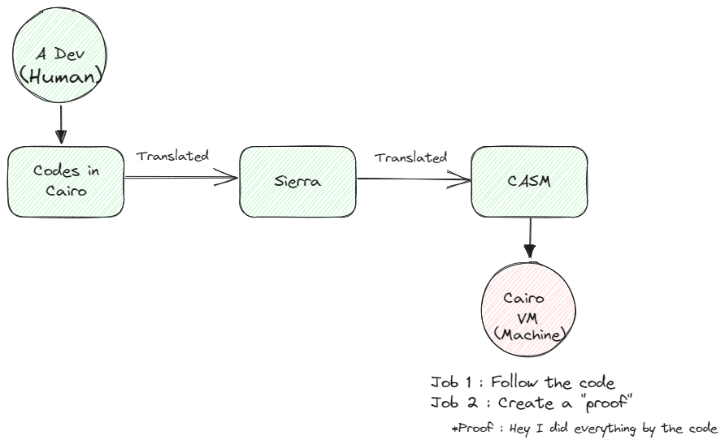
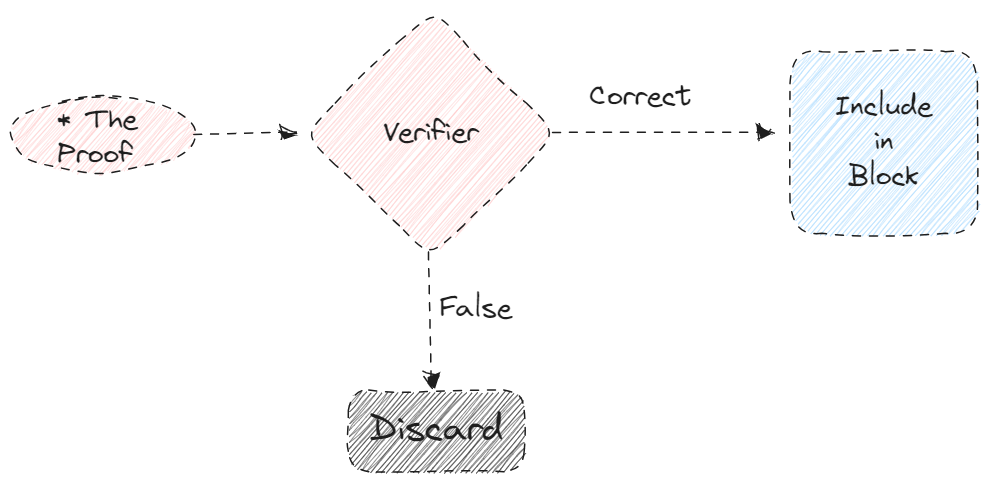

# Why Cairo VM or Why Java?

This document provides a deeper dive into the rationale behind implementing Cairo VM in Java.

## Why Cairo VM?

### The Starknet Ecosystem

#### What is Cairo and Cairo VM?

- **Cairo** is a programming language invented by StarkWare for Starknet. It uses ZK-STARK technology and is designed specifically for writing provable programs.

- (TODO: Add link explaining what "ZK proof" means)

- **Cairo VM** is the execution engine that runs codes in Cairo. Similar to how the EVM executes Solidity bytecode — but Cairo VM creates the cryptographic proof for it.
- If you write any kind of program in Cairo and run it,
    1) It executes that program
    2) It automatically generates a ZK-Proof of that execution.

#### Cairo's Advantages Among ZK Ecosystems

Compared to other zero-knowledge ecosystems, Cairo offers several key advantages:

- **Rust-like Syntax**: Cairo is easy for Rust developers to learn and use.
- **General-Purpose Language**: Cairo was designed to be fast, capable of running any program, and secure.
- **Ethereum Layer 2 Security**: While Layer 1s and Layer 2s (including Starknet) can fail, Ethereum's security is robust. This means Starknet leverages Ethereum's battle-tested security.
- **Bitcoin Layer 2 Ambition**: StarkWare is working to make Starknet a Bitcoin Layer 2. This is significant given the massive Bitcoin ecosystem and business opportunities. StarkWare consistently delivers on their roadmap.
- **ZK-STARK**: Uses ZK-STARKs (Scalable Transparent Arguments of Knowledge) which don't require trusted setups, unlike SNARKs used in many other ZK systems, and are also post-quantum secure.
- **Provenance**: Developed by StarkWare, which has been pioneering ZK technology since 2018 and has proven production deployments.
- **Ecosystem Maturity**: Cairo has a growing ecosystem with compilers, tooling, and libraries that are better than other ZK DSLs.
- **Performance**: Cairo VM is already fast and is becoming faster with the STWO prover.

(TODO : What is STWO)

#### Why Starknet is Advanced Among Blockchains

Starknet stands out in the blockchain landscape for several reasons:

- **True Scalability**: ZK-proofs are very small and fast to verify. Starknet's benchmarks outperform other ZK-based blockchains.
- **Privacy on Demand**: You can hide private information on demand.
- **Proven Technology**: Built on battle-tested ZK-STARK technology that has been used in production for years. 

## Why Java?

#### Java's Advantages Among Programming Languages

Java offers unique advantages that make it ideal for implementing Cairo VM:

Java can be a bit slower than C or Rust, but still very fast and used everywhere.

- **Platform Independence**: "Write once, run anywhere" (WORA) philosophy means Java code runs on any platform with a JVM, making deployment flexible across different infrastructures. This means running Starknet node on your PC, Laptop, Risc-V home server, mobile phone. Critical for decentralized blockchain
- **Netflix is made of JAVA**: Netflix' backend infrastructure is made of JAVA. There are millions of cases like this. JAVA is strong, resilient, durable, maintainable. 
- **Strong Type Safety**: Java's static typing and compile-time checks reduce runtime errors, critical for blockchain infrastructure where bugs can be costly
- **Memory Management**: Automatic garbage collection reduces memory-related bugs while still allowing performance tuning when needed
- **Mature Language**: Decades of refinement have resulted in a stable, well-designed language with clear patterns and best practices
- **Rich Standard Library**: Comprehensive standard library reduces dependencies and provides robust implementations of common functionality
- **Multi-threading Support**: Built-in concurrency primitives enable efficient parallel processing, important for VM execution and proof generation
- **Backward Compatibility**: Java's commitment to backward compatibility ensures long-term stability for infrastructure projects

#### Java Performance

Java's performance characteristics make it well-suited for Cairo VM:

- **JVM Optimization**: Modern JVMs (like HotSpot, GraalVM) use Just-In-Time (JIT) compilation to optimize hot code paths, achieving near-native performance
- **GraalVM Native Image**: Can compile Java to native executables for even better startup time and memory usage
- **Proven at Scale**: Java powers some of the world's largest systems (e.g., financial trading platforms, big data systems) handling millions of transactions per second
- **Memory Efficiency**: Modern JVMs are highly optimized for memory usage, with advanced garbage collection algorithms (G1, ZGC) that minimize pause times
- **Performance Tooling**: Excellent profiling and monitoring tools (JProfiler, VisualVM, JFR) enable fine-tuning for optimal performance
- **Battle-Tested**: Java's performance has been proven in production environments for decades, giving confidence for critical infrastructure

#### The Java Ecosystem Size

The Java ecosystem is one of the largest and most mature in software development:

- **Developer Base**: Over 9 million Java developers worldwide, making it one of the most popular programming languages
- **Enterprise Adoption**: Used by 90% of Fortune 500 companies, indicating massive enterprise infrastructure investment
- **Library Ecosystem**: Maven Central hosts over 5 million Java libraries and frameworks, covering virtually every use case
- **Framework Diversity**: Rich ecosystem including Spring, Jakarta EE, Micronaut, Quarkus, and many others for different application needs
- **Tooling Maturity**: Extensive tooling ecosystem including IDEs (IntelliJ IDEA, Eclipse, NetBeans), build tools (Maven, Gradle), and monitoring solutions
- **Infrastructure**: Java runs on billions of devices, from servers to embedded systems, demonstrating its versatility
- **Community**: Large, active open-source community contributing libraries, frameworks, and improvements
- **Bitcoin Ecosystem**: Many Bitcoin infrastructure projects use Java (e.g., BitcoinJ, various exchange backends), creating natural integration opportunities

### Enterprise Adoption
- Java is one of the most widely used programming languages in enterprise environments
- Large organizations already have Java infrastructure, tooling, and expertise
- Java's mature ecosystem includes robust libraries, frameworks, and deployment tools

### Bitcoin Ecosystem Integration
- Many Bitcoin-related companies and infrastructure providers use Java
- Java's cross-platform nature makes it ideal for diverse deployment scenarios
- Existing Java-based Bitcoin infrastructure can seamlessly integrate Cairo VM

### Strategic Benefits
- **Unified Stack**: Teams can maintain a single technology stack from frontend to blockchain
- **Existing Tooling**: Leverage existing Java monitoring, debugging, and deployment tools
- **Talent Pool**: Access to a large pool of Java developers
- **Infrastructure**: Reuse existing Java infrastructure and deployment pipelines

## The Opportunity

By bringing Cairo VM to Java, we're not just adding another client implementation—we're:
- Opening Starknet to a massive ecosystem of Java-based companies
- Enabling Bitcoin ecosystem players to adopt Starknet capabilities
- Providing enterprise-grade infrastructure options for Starknet
- Contributing to client diversity, which is essential for network security and decentralization

## Conclusion

The combination of Cairo VM's powerful ZK-proof capabilities with Java's enterprise-ready ecosystem creates a compelling opportunity to expand Starknet's reach and adoption.

